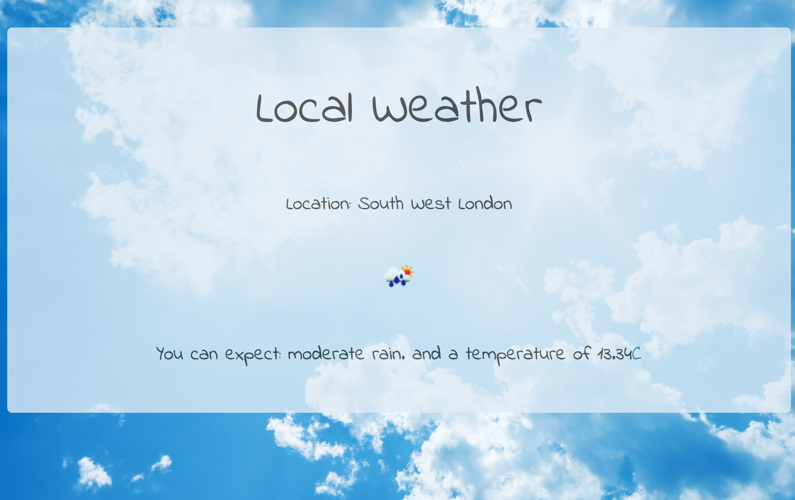

Super Local Weather
===================
A front end project using weather and geolocation api's to provide hyper-local weather information. The project can be viewed easily on [Codepen](http://codepen.io/ALRW/pen/vGdmaw).

This used the browsers inbuilt geolocation capability alongside the following API's to deliver detailed local weather information.

- [Geonames](http://api.geonames.org):  Used to provide the name of the nearest population center to the current location of the user.

- [OpenWeather](http://api.openweathermap.org): Used to provide weather data given the location of a user.
